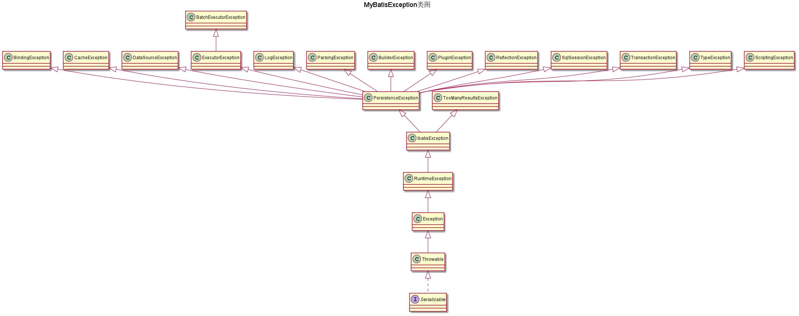

# MyBatis

Myabits source read note and sample

## 目录

- [源码阅读的意义](#源码阅读的意义)
    - [为什么要阅读源码](#为什么要阅读源码)
    - [如何阅读源码](#如何阅读源码)
    - [为什么阅读MyBatis源码](#[为什么阅读MyBatis源码)
    - [源码阅读流程](#源码阅读流程)
- [Mybatis概述](#Mybatis概述)
    - [JDBC如何处理数据库操作](#JDBC如何处理数据库操作)
    - [ORM框架](#ORM框架)
    - [MyBatis特点](#MyBatis特点)
    - [MyBatis配置方式](#MyBatis配置方式)
    - [MyBatis使用示例](#MyBatis使用示例)
        - [单独使用](#单独使用)
        - [在SpringBoot中使用](#在SpringBoot中使用)
    - [MyBatis核心业务功能](#MyBatis核心业务功能)
- [MyBatis跟踪调试](#MyBatis跟踪调试)
    - [类加载流程](#类加载流程)
    - [MaBatis业务流程](#MaBatis业务流程)
        - [初始化阶段](#初始化阶段)
            - [静态代码块执行](#静态代码块执行)
            - [读取配置文件](#读取配置文件)
            - [解析配置文件](#解析配置文件)
        - [数据读写阶段](#数据读写阶段)
            - [创建SqlSessionFactory对象](#创建SqlSessionFactory对象)
            - [获取SqlSession](#获取SqlSession)
            - [映射接口与映射文件的绑定](#映射接口与映射文件的绑定)
            - [映射接口的代理](#映射接口的代理)
            - [SQL语句查找](#SQL语句查找)
            - [查询结果缓存](#查询结果缓存)
            - [数据库查询](#数据库查询)
            - [处理结果集](#处理结果集)
- [MyBatis源码架构](#MyBatis源码架构)
- [Mybatis分包](#Mybatis分包)
    - [基础功能](#基础功能)
        - [annotations](#annotations)
            - [Java注解](#Java注解)
              - [元注解](#元注解)
              - [自定义注解](#自定义注解)
            - [param注解](#param注解)
        - [exceptions](#exceptions)
            - [Java中的异常](#Java中的异常)
        - [reflection](#reflection)
            - [装饰器模式](#装饰器模式)
            - [反射](#反射)
                - [反射功能](#反射功能)
                - [反射基础包](#反射基础包)
                - [反射常用操作](#反射常用操作)
            - [工厂模式](#工厂模式)
    - [配置解析](#配置解析)
    - [核心操作](#核心操作)
- [阅读技巧](#阅读技巧)
- [设计思想](#设计思想)
    - [包划分](#包划分)
- [代码实践](#代码实践)
  - [工具类构造器私有化](#工具类构造器私有化)

## 源码阅读的意义

### 为什么要阅读源码

- 理解MyBatis实现原理
- 学习优秀的的设计和技巧
- 提示自我

### 如何阅读源码

- 调试追踪
- 归类总结
- 上下文整合
- 合理利用工具

### 为什么阅读MyBatis源码

- MyBatis 应用广泛
- 涉及知识面广
- 代码量合适
- 深入理解MyBatis原理，学习优秀涉及。

### 源码阅读流程

- 掌握项目使用方法
- 把握核心功能，重点关注核心功能相关代码

## Mybatis概述

### JDBC如何处理数据库操作

- 连接流程  
  建立连接 → 拼装和执行sql语句 → 转化操作结果
  [示例代码](JDBCDemo)

### ORM框架

对象关系映射(Object Relational Mapping ,ORM)

### MyBatis特点

- 核心映射 Java方法与SQL语句关联，SQL语句的参数或结果和对象关联，屏蔽关系型数据库，面向对象的方式进行数据库读写。
- 缓存功能
- 懒加载功能
- 主键自增功能
- 多数据集处理

### MyBatis配置方式

- 完全代码配置
- 基于XMl配置
- 外部框架配置

### MyBatis使用示例

[官方教程](https://mybatis.org/mybatis-3/zh/getting-started.html)

#### 单独使用

[示例代码](MyBatisDemo)

##### 引入 MyBatis 依赖

使用 maven ,引入依赖

```xml

<dependency>
    <groupId>org.mybatis</groupId>
    <artifactId>mybatis</artifactId>
    <version>x.x.x</version>
</dependency>
```

##### 构建 SqlSessionFactory

示例代码 [MyBatisDemo](MyBatisDemo)

- 从XML中构建  
  从 XML 配置文件或一个预先配置的 Configuration 实例来构建出 SqlSessionFactory 实例。
- 用Java代码直接构建  
  使用 ```Configuration ``` 进行配置

#### 在SpringBoot中使用

结合Spring Boot 使用  
示例代码 [SpringMyBatis](SpringMyBatis)

### MyBatis核心业务功能

简化 JDBC 操作流程，去除重复性操作，将面向过程的操作变成面向对象的操作。

- 将输入语句转换成纯粹的SQL语句
- 将数据库操作节点和映射接口中的抽象方法进行绑定，在抽象方法被调用时执行数据库操作
- 将输入参数对象转化为数据库操作语句中的参数
- 将数据库操作语句的返回结果转化为对象

## MyBatis跟踪调试

对MyBatis 源码进行跟踪调试，了解源码的运行流程。
[示例代码](SpringMyBatisDebugDemo)

### 类加载流程

加载 -> 验证 -> 准备 -> 解析 -> 初始化

##### 加载

把class 字节码文件从各个来源通过类加载器载入内存

- 字节码来源
    - 编译生成的.class文件
    - jar包中的.class文件
    - 远程动态代理实时编译
- 类加载器
    - 启动类加载器
    - 扩展类加载器
    - 应用类加载器
    - 自定义类加载器

##### 验证

- 验证文件格式
- 元数据验证
- 字节码验证
- 符号引用验证

##### 准备

为类变量分配内存，赋初值,根据不同类型的默认初始值为变量赋初值

- 基本内型:默认0
- 引用类型:null
- 常量: 设置的初始值

##### 解析

将常量池内的符号引用替换为直接引用的过程。

##### 初始化

这个阶段主要是对类变量初始化，是执行类构造器的过程。

### MaBatis业务流程

在项目启动时开始执行，完成配置文件解析，数据库等连接工作。 加载到配置里面的映射文件和接口是配置对象，实际调用时才通过反射，生成动态代理对象，用于执行具体的操作

#### 初始化阶段

##### 静态代码块执行

静态变量初始化

##### 读取配置文件

通过类加载器读取外部资源. 利用Resources读取配置文件，得到当地资源

- 存在多个类加资器如何处理 将类加载器包装起来，当作一个类加载器使用 ,参考 ```ClassLoaderWrapper```

##### 解析配置文件

使用builder模式构建 SqlSessionFactory

```java
SqlSessionFactory sqlSessionFactory=new SqlSessionFactoryBuilder().build(inputStream);
```

- 解析配置文件
- 解析映射文件
- 将解析结果放入Configuration 对象

#### 数据读写阶段

##### 创建SqlSessionFactory对象

- 调用build ,将 Configuration 传给 SqlSessionFactory

##### 获取SqlSession

```sqlSessionFactory.openSession()``` 获取到SqlSession

```java
public class DefaultSqlSession implements SqlSession {

    private final Configuration configuration;
    private final Executor executor;

    private final boolean autoCommit;
    private boolean dirty;
    private List<Cursor<?>> cursorList;

    public DefaultSqlSession(Configuration configuration, Executor executor, boolean autoCommit) {
        this.configuration = configuration;
        this.executor = executor;
        this.dirty = false;
        this.autoCommit = autoCommit;
    }

    public DefaultSqlSession(Configuration configuration, Executor executor) {
        this(configuration, executor, false);
    }

    @Override
    public <T> T selectOne(String statement) {
        return this.selectOne(statement, null);
    }

    @Override
    public <T> T selectOne(String statement, Object parameter) {
        // Popular vote was to return null on 0 results and throw exception on too many.
        List<T> list = this.selectList(statement, parameter);
        if (list.size() == 1) {
            return list.get(0);
        } else if (list.size() > 1) {
            throw new TooManyResultsException("Expected one result (or null) to be returned by selectOne(), but found: " + list.size());
        } else {
            return null;
        }
    }

    @Override
    public <K, V> Map<K, V> selectMap(String statement, String mapKey) {
        return this.selectMap(statement, null, mapKey, RowBounds.DEFAULT);
    }

    @Override
    public <K, V> Map<K, V> selectMap(String statement, Object parameter, String mapKey) {
        return this.selectMap(statement, parameter, mapKey, RowBounds.DEFAULT);
    }

    @Override
    public <K, V> Map<K, V> selectMap(String statement, Object parameter, String mapKey, RowBounds rowBounds) {
        final List<? extends V> list = selectList(statement, parameter, rowBounds);
        final DefaultMapResultHandler<K, V> mapResultHandler = new DefaultMapResultHandler<>(mapKey,
                configuration.getObjectFactory(), configuration.getObjectWrapperFactory(), configuration.getReflectorFactory());
        final DefaultResultContext<V> context = new DefaultResultContext<>();
        for (V o : list) {
            context.nextResultObject(o);
            mapResultHandler.handleResult(context);
        }
        return mapResultHandler.getMappedResults();
    }

    @Override
    public <T> Cursor<T> selectCursor(String statement) {
        return selectCursor(statement, null);
    }

    @Override
    public <T> Cursor<T> selectCursor(String statement, Object parameter) {
        return selectCursor(statement, parameter, RowBounds.DEFAULT);
    }

    @Override
    public <T> Cursor<T> selectCursor(String statement, Object parameter, RowBounds rowBounds) {
        try {
            MappedStatement ms = configuration.getMappedStatement(statement);
            Cursor<T> cursor = executor.queryCursor(ms, wrapCollection(parameter), rowBounds);
            registerCursor(cursor);
            return cursor;
        } catch (Exception e) {
            throw ExceptionFactory.wrapException("Error querying database.  Cause: " + e, e);
        } finally {
            ErrorContext.instance().reset();
        }
    }

    @Override
    public <E> List<E> selectList(String statement) {
        return this.selectList(statement, null);
    }

    @Override
    public <E> List<E> selectList(String statement, Object parameter) {
        return this.selectList(statement, parameter, RowBounds.DEFAULT);
    }

    @Override
    public <E> List<E> selectList(String statement, Object parameter, RowBounds rowBounds) {
        return selectList(statement, parameter, rowBounds, Executor.NO_RESULT_HANDLER);
    }

    private <E> List<E> selectList(String statement, Object parameter, RowBounds rowBounds, ResultHandler handler) {
        try {
            MappedStatement ms = configuration.getMappedStatement(statement);
            return executor.query(ms, wrapCollection(parameter), rowBounds, handler);
        } catch (Exception e) {
            throw ExceptionFactory.wrapException("Error querying database.  Cause: " + e, e);
        } finally {
            ErrorContext.instance().reset();
        }
    }

    @Override
    public void select(String statement, Object parameter, ResultHandler handler) {
        select(statement, parameter, RowBounds.DEFAULT, handler);
    }

    @Override
    public void select(String statement, ResultHandler handler) {
        select(statement, null, RowBounds.DEFAULT, handler);
    }

    @Override
    public void select(String statement, Object parameter, RowBounds rowBounds, ResultHandler handler) {
        selectList(statement, parameter, rowBounds, handler);
    }

    @Override
    public int insert(String statement) {
        return insert(statement, null);
    }

    @Override
    public int insert(String statement, Object parameter) {
        return update(statement, parameter);
    }

    @Override
    public int update(String statement) {
        return update(statement, null);
    }

    @Override
    public int update(String statement, Object parameter) {
        try {
            dirty = true;
            MappedStatement ms = configuration.getMappedStatement(statement);
            return executor.update(ms, wrapCollection(parameter));
        } catch (Exception e) {
            throw ExceptionFactory.wrapException("Error updating database.  Cause: " + e, e);
        } finally {
            ErrorContext.instance().reset();
        }
    }

    @Override
    public int delete(String statement) {
        return update(statement, null);
    }

    @Override
    public int delete(String statement, Object parameter) {
        return update(statement, parameter);
    }

    @Override
    public void commit() {
        commit(false);
    }

    @Override
    public void commit(boolean force) {
        try {
            executor.commit(isCommitOrRollbackRequired(force));
            dirty = false;
        } catch (Exception e) {
            throw ExceptionFactory.wrapException("Error committing transaction.  Cause: " + e, e);
        } finally {
            ErrorContext.instance().reset();
        }
    }

    @Override
    public void rollback() {
        rollback(false);
    }

    @Override
    public void rollback(boolean force) {
        try {
            executor.rollback(isCommitOrRollbackRequired(force));
            dirty = false;
        } catch (Exception e) {
            throw ExceptionFactory.wrapException("Error rolling back transaction.  Cause: " + e, e);
        } finally {
            ErrorContext.instance().reset();
        }
    }

    @Override
    public List<BatchResult> flushStatements() {
        try {
            return executor.flushStatements();
        } catch (Exception e) {
            throw ExceptionFactory.wrapException("Error flushing statements.  Cause: " + e, e);
        } finally {
            ErrorContext.instance().reset();
        }
    }

    @Override
    public void close() {
        try {
            executor.close(isCommitOrRollbackRequired(false));
            closeCursors();
            dirty = false;
        } finally {
            ErrorContext.instance().reset();
        }
    }

    private void closeCursors() {
        if (cursorList != null && !cursorList.isEmpty()) {
            for (Cursor<?> cursor : cursorList) {
                try {
                    cursor.close();
                } catch (IOException e) {
                    throw ExceptionFactory.wrapException("Error closing cursor.  Cause: " + e, e);
                }
            }
            cursorList.clear();
        }
    }

    @Override
    public Configuration getConfiguration() {
        return configuration;
    }

    @Override
    public <T> T getMapper(Class<T> type) {
        return configuration.getMapper(type, this);
    }

    @Override
    public Connection getConnection() {
        try {
            return executor.getTransaction().getConnection();
        } catch (SQLException e) {
            throw ExceptionFactory.wrapException("Error getting a new connection.  Cause: " + e, e);
        }
    }

    @Override
    public void clearCache() {
        executor.clearLocalCache();
    }

    private <T> void registerCursor(Cursor<T> cursor) {
        if (cursorList == null) {
            cursorList = new ArrayList<>();
        }
        cursorList.add(cursor);
    }

    private boolean isCommitOrRollbackRequired(boolean force) {
        return (!autoCommit && dirty) || force;
    }

    private Object wrapCollection(final Object object) {
        return ParamNameResolver.wrapToMapIfCollection(object, null);
    }

    /**
     * @deprecated Since 3.5.5
     */
    @Deprecated
    public static class StrictMap<V> extends HashMap<String, V> {

        private static final long serialVersionUID = -5741767162221585340L;

        @Override
        public V get(Object key) {
            if (!super.containsKey(key)) {
                throw new BindingException("Parameter '" + key + "' not found. Available parameters are " + this.keySet());
            }
            return super.get(key);
        }

    }

}
```

#### 映射接口与映射文件的绑定

```java
UserMapper userMapper=session.getMapper(UserMapper.class);
```

通过映射接口信息，从已解析的文件中找到对应的映射文件，根据映射文件组建并返回实现对象

- 映射接口文件 存有接口的文件，用于生成动态代理对象
- 映射文件 存有SQL操作的文件

```java
public class MapperRegistry {

    private final Configuration config;
    private final Map<Class<?>, MapperProxyFactory<?>> knownMappers = new HashMap<>();

    public MapperRegistry(Configuration config) {
        this.config = config;
    }

    @SuppressWarnings("unchecked")
    public <T> T getMapper(Class<T> type, SqlSession sqlSession) {
        final MapperProxyFactory<T> mapperProxyFactory = (MapperProxyFactory<T>) knownMappers.get(type);
        if (mapperProxyFactory == null) {
            throw new BindingException("Type " + type + " is not known to the MapperRegistry.");
        }
        try {
            return mapperProxyFactory.newInstance(sqlSession);
        } catch (Exception e) {
            throw new BindingException("Error getting mapper instance. Cause: " + e, e);
        }
    }
}

```

- 工厂模式

需要什么类型，就给到什么类型

#### 映射接口的代理

利用反射生成动态代理对象 MapperProxyFactory

```java
public class MapperProxyFactory<T> {

    private final Class<T> mapperInterface;
    private final Map<Method, MapperMethodInvoker> methodCache = new ConcurrentHashMap<>();

    public MapperProxyFactory(Class<T> mapperInterface) {
        this.mapperInterface = mapperInterface;
    }

    public Class<T> getMapperInterface() {
        return mapperInterface;
    }

    public Map<Method, MapperMethodInvoker> getMethodCache() {
        return methodCache;
    }

    @SuppressWarnings("unchecked")
    protected T newInstance(MapperProxy<T> mapperProxy) {
        return (T) Proxy.newProxyInstance(mapperInterface.getClassLoader(), new Class[]{mapperInterface}, mapperProxy);
    }

    public T newInstance(SqlSession sqlSession) {
        final MapperProxy<T> mapperProxy = new MapperProxy<>(sqlSession, mapperInterface, methodCache);
        return newInstance(mapperProxy);
    }

}

```

通过 MapperMethod.execute()  执行执行SQL操作。完成映射接口注入实现的过程，映射接口中的抽象方法的调用转变成了数据库操作

```java
public class MapperMethod {

    private final SqlCommand command;
    private final MethodSignature method;

    public MapperMethod(Class<?> mapperInterface, Method method, Configuration config) {
        this.command = new SqlCommand(config, mapperInterface, method);
        this.method = new MethodSignature(config, mapperInterface, method);
    }

    public Object execute(SqlSession sqlSession, Object[] args) {
        Object result;
        switch (command.getType()) {
            case INSERT: {
                Object param = method.convertArgsToSqlCommandParam(args);
                result = rowCountResult(sqlSession.insert(command.getName(), param));
                break;
            }
            case UPDATE: {
                Object param = method.convertArgsToSqlCommandParam(args);
                result = rowCountResult(sqlSession.update(command.getName(), param));
                break;
            }
            case DELETE: {
                Object param = method.convertArgsToSqlCommandParam(args);
                result = rowCountResult(sqlSession.delete(command.getName(), param));
                break;
            }
            case SELECT:
                if (method.returnsVoid() && method.hasResultHandler()) {
                    executeWithResultHandler(sqlSession, args);
                    result = null;
                } else if (method.returnsMany()) {
                    result = executeForMany(sqlSession, args);
                } else if (method.returnsMap()) {
                    result = executeForMap(sqlSession, args);
                } else if (method.returnsCursor()) {
                    result = executeForCursor(sqlSession, args);
                } else {
                    Object param = method.convertArgsToSqlCommandParam(args);
                    result = sqlSession.selectOne(command.getName(), param);
                    if (method.returnsOptional()
                            && (result == null || !method.getReturnType().equals(result.getClass()))) {
                        result = Optional.ofNullable(result);
                    }
                }
                break;
            case FLUSH:
                result = sqlSession.flushStatements();
                break;
            default:
                throw new BindingException("Unknown execution method for: " + command.getName());
        }
        if (result == null && method.getReturnType().isPrimitive() && !method.returnsVoid()) {
            throw new BindingException("Mapper method '" + command.getName()
                    + " attempted to return null from a method with a primitive return type (" + method.getReturnType() + ").");
        }
        return result;
    }


}
```

#### SQL语句查找

通过 MappedStatement 定义数据库操作语句，输入输出等信息.去Configuration对象中查找已经映射的文件信息

```java
public class Configuration {
    public MappedStatement getMappedStatement(String id) {
        return this.getMappedStatement(id, true);
    }

    public MappedStatement getMappedStatement(String id, boolean validateIncompleteStatements) {
        if (validateIncompleteStatements) {
            buildAllStatements();
        }
        return mappedStatements.get(id);
    }
}
```

#### 查询结果缓存

将SQL语句去掉标签后作为缓存key ,先从缓存中，如果没有，则通过delegate调用 query方法,执行数据库查询

```java
public class DefaultSqlSession implements SqlSession {
    private <E> List<E> selectList(String statement, Object parameter, RowBounds rowBounds, ResultHandler handler) {
        try {
            MappedStatement ms = configuration.getMappedStatement(statement);
            return executor.query(ms, wrapCollection(parameter), rowBounds, handler);
        } catch (Exception e) {
            throw ExceptionFactory.wrapException("Error querying database.  Cause: " + e, e);
        } finally {
            ErrorContext.instance().reset();
        }
    }
}
```

```java
public interface Executor {
    <E> List<E> query(MappedStatement ms, Object parameter, RowBounds rowBounds, ResultHandler resultHandler) throws SQLException;
}
```

#### 数据库查询

- 进行数据库查询之前,先查询缓存,数据库查询到结果后,放入缓存
- SQL语句转换成PreparedStatement对象进行执行, SQL语句 -> MappedStatement -> Statement -> PreparedStatement
- 结果集交给ResultHandler对象处理

#### 处理结果集

ResultHandler处理成需要的对象

```java
public class DefaultResultSetHandler implements ResultSetHandler {
    @Override
    public List<Object> handleResultSets(Statement stmt) throws SQLException {
        ErrorContext.instance().activity("handling results").object(mappedStatement.getId());

        final List<Object> multipleResults = new ArrayList<>();

        int resultSetCount = 0;
        ResultSetWrapper rsw = getFirstResultSet(stmt);

        List<ResultMap> resultMaps = mappedStatement.getResultMaps();
        int resultMapCount = resultMaps.size();
        validateResultMapsCount(rsw, resultMapCount);
        while (rsw != null && resultMapCount > resultSetCount) {
            ResultMap resultMap = resultMaps.get(resultSetCount);
            handleResultSet(rsw, resultMap, multipleResults, null);
            rsw = getNextResultSet(stmt);
            cleanUpAfterHandlingResultSet();
            resultSetCount++;
        }

        String[] resultSets = mappedStatement.getResultSets();
        if (resultSets != null) {
            while (rsw != null && resultSetCount < resultSets.length) {
                ResultMapping parentMapping = nextResultMaps.get(resultSets[resultSetCount]);
                if (parentMapping != null) {
                    String nestedResultMapId = parentMapping.getNestedResultMapId();
                    ResultMap resultMap = configuration.getResultMap(nestedResultMapId);
                    handleResultSet(rsw, resultMap, null, parentMapping);
                }
                rsw = getNextResultSet(stmt);
                cleanUpAfterHandlingResultSet();
                resultSetCount++;
            }
        }

        return collapseSingleResultList(multipleResults);
    }

}
```

- createResultObject()
  创建输出结果对象 使用类型处理器或构造方法来构建输出对象。
- applyAutomaticMappings()
  将数据记录的值赋给输出对象，需要开启属性自动映射 循环遍历属性，然后调用"metaObject.setValue（mapping.property，value）"语句为属性赋值。
- applyPropertyMappings 按照映射设置，给输出结果对象的属性赋值。对应mapper中的resultMap

## MyBatis源码架构

### Mybatis分包

#### 基础功能

基础功能,工具类,日志,异常处理,文件IO

#### annotations
 [annotations代码](mybatis-3/src/main/java/org/apache/ibatis/annotations)

##### Java注解
标记作用
###### 元注解
用来注解其他注解的的注解，
- @Target 
用来标记注解可以用在什么地方,类型为,可以同时使用多个
```java
public enum ElementType {
    /** 
     * Class, interface (including annotation type), or enum declaration 
     * 类，接口，注解，枚举
     * */
    TYPE,

    /** 
     * Field declaration (includes enum constants) 
     * 字段
     * */
    FIELD,

    /** 
     * Method declaration 
     * 方法
     * */
    METHOD,

    /**
     *  Formal parameter declaration 
     *  参数
     * */
    PARAMETER,

    /** 
     * Constructor declaration 
     * 构造器
     * 
     * */
    CONSTRUCTOR,

    /**
     *  Local variable declaration 
     *  局部变量
     * */
    LOCAL_VARIABLE,

    /** 
     * Annotation type declaration 
     * 注解
     * */
    ANNOTATION_TYPE,

    /** 
     * Package declaration 
     * 包
     * */
    PACKAGE,

    /**
     * Type parameter declaration
     * 类型参数
     * @since 1.8
     */
    TYPE_PARAMETER,

    /**
     * Use of a type
     * 类型使用
     * @since 1.8
     */
    TYPE_USE
}
``` 

- @Retention
注解的生命周期，注解会保留到哪一阶
```java
public enum RetentionPolicy {
    /**
     * Annotations are to be discarded by the compiler.
     * 保留到源代码阶段，编译时会被擦除
     */
    SOURCE,

    /**
     * Annotations are to be recorded in the class file by the compiler
     * but need not be retained by the VM at run time.  This is the default
     * behavior.
     * 保留到类文件阶段，在JVM运行时不包含这些信息
     */
    CLASS,

    /**
     * Annotations are to be recorded in the class file by the compiler and
     * retained by the VM at run time, so they may be read reflectively.
     * 保留到JVM运行阶段
     * @see java.lang.reflect.AnnotatedElement
     */
    RUNTIME
}

```

- @Documented
注解会在javadoc中生成
  
- @Inherited
允许子类继承父类的该注解，不能从接口继承
  
- @Repeatable
jdk8引入,注解可以在同一个地方可以重复使用多次
  
###### 自定义注解
使用元注解配置注解信息 
[自定义注解示例](mybatis-3/src/test/java/org/apache/ibatis/annotation/CustomizeAnnotationTest.java)

##### param注解
在参数上使用该注解对参数进行命名，在映射文件中则可以使用该名字，可以实现字段名字的替换.
在ParamNameResolver中实现替换。

```java
@Documented
@Retention(RetentionPolicy.RUNTIME) //保存到运行时
@Target(ElementType.PARAMETER) //只能用狂参数数
public @interface Param {
    /**
     * Returns the parameter name.
     * 参数名字
     * @return the parameter name
     */
    String value();
}
```
#### exceptions
异常工厂和Mybatis异常父类
[exceptions代码](mybatis-3/src/main/java/org/apache/ibatis/exceptions)  


##### Java中的异常

“异常”代表程序运行中遇到了意料之外的事情，父类为 Throwable

- Throwable
    - Error及其子类 代表了 JVM自身的异常。这一类异常发生时，无法通过程序来修正。最可靠的方式就是尽快停止 JVM的运行。
    - Exception 代表程序运行中发生了意料之外的事情, 可以通过Java异常处理机制处理。
        - RuntimeException 运行时异常,如空指针异常,
        - CheckException 受检查异常，不可预知和避免，需要处理

- [io](mybatis-3/src/main/java/org/apache/ibatis/io)
- [lang](mybatis-3/src/main/java/org/apache/ibatis/lang)
- [logging](mybatis-3/src/main/java/org/apache/ibatis/logging)

#### reflection

封装常用反射操作，对对象进行反射包装，方便反射操作
[reflection代码](mybatis-3/src/main/java/org/apache/ibatis/reflection)

##### 装饰器模式

装饰器模式又称包装模式，是一种结构型模式。这种设计模式是指能够在一个类的基础上增加一个装饰类（也可以叫包装类），并在装饰类中增加一些新的特性和功能。 这样，通过对原有类的包装，就可以在不改变原有类的情况下为原有类增加更多的功能。
[示例代码](mybatis-3/src/test/java/org/apache/ibatis/reflection/patterns)

##### 反射

通过反射，能够在类的运行过程中知道这个类有哪些属性和方法，还可以修改属性、调用方法、建立类的实例。

##### 反射功能

- 在运行时判断任意一个对象所属的类
- 在运行时构造任意一个类的对象
- 在运行时修改任意一个对象的成员变量
- 在运行时调用任意一个对象的方法

##### 反射基础包

围绕 Java 类的成员展开,属性字段、构造函数、方法及各个上面的注解

- Object  
  所有类的父类,提供基本方法
    - getClass()
      获取对象类类型
- Class  
  正在运行的 Java 应用程序中的类的实例。
- Method 类的方法信息
- Constructor 构造方法信息
- Field 类的属性信息
- Annotation 注解信息，类，方法，字段上都可以有

##### 反射常用操作

[示例代码](mybatis-3/src/test/java/org/apache/ibatis/reflection/ReflectionTest.java)

###### 获取Class对象

- Class.forName()
  需要类的全路径名
- Object.class 需要导入类的包
- getClass()
  已经有对象

###### 获取成员变量

- getDeclaredFields()
  获取所有字段,无法获取父类字段
  ``` checkMemberAccess(sm, Member.DECLARED, Reflection.getCallerClass(), true);```
- getFields()
  获取 public 字段
  ```checkMemberAccess(sm, Member.PUBLIC, Reflection.getCallerClass(), true);```

###### 获取构造方法

- getDeclaredConstructors()
  获取所有构造器
- getConstructors()
  获取 pulibkc 构造器

###### 获取非构造方法

- getDeclaredMethods()
  获取所有方法，不包括父类的方法
- getMethods()
  获取所有 public 方法,包含父类

###### 获取注解

通过Class,Filed，Method,Constructor等对象获取到对应的注解信息

- getAnnotations()
  获取到所有注解

###### 调用方法

- invoke()执行方法

###### 动态构建对象，访问私有字段和方法

- 先拿到Class对象
- 创建对象
    - newInstance()
      需要无参构造器
    - 通过Constructor 构造对象 拿到构造器，用构造器来newInstance()
- 操作字段
    - 获取字段: getDeclaredField(String name)
    - 设置访问权限:setAccessible()
    - 设置值:set(Object obj, Object value)
- 操作方法
    - 获取方法:  getDeclaredMethod(String name, Class<?>... parameterTypes)
    - 设置访问权限: setAccessible(boolean flag)
    - 执行方法: invoke(Object obj, Object... args)
###### 动态代理
直接创建接口的实例
通过 ```Roroxy.newInstance()``` 创建接口对象

利用反射实现动态代理

#### 工厂模式
ObjectFactory
```java
public interface ObjectFactory {
    /**
     * 设置工厂属性
     */
  default void setProperties(Properties properties) {
    // NOP
  }

    /**
     * 使用默认构造器创建对象
     */
  <T> T create(Class<T> type);


    /**
     * 使用给定的构造器创建对象
     */
  <T> T create(Class<T> type, List<Class<?>> constructorArgTypes, List<Object> constructorArgs);

  
  <T> boolean isCollection(Class<T> type);

}
```
DefaultObjectFactory 默认实现
##### 类型实现
- List,Collection,Iterable
  转成 ArrayList
- Map
  转成 HashMap
- SortedSet
  转成 TreeSet
- Set
  转成 HashSet
- 其他类型
  转成原始类型
#### 执行器 Invoker
```java
public interface Invoker {
  Object invoke(Object target, Object[] args) throws IllegalAccessException, InvocationTargetException;

  Class<?> getType();
}

```
##### GetFieldInvoker 
对象属性的读操作
##### SetFieldInvoker
对象属性的写操作
##### MethodInvoker
其他方法的操作
#### MyBatis反射核心
```Reflector```
```java
public class Reflector {

    //要解析的类
    private final Class<?> type;
    //可读属性名字
    private final String[] readablePropertyNames;
    //可写属性名字
    private final String[] writablePropertyNames;

    // setter和属性映射,键为属性名，对应相应的setter
    private final Map<String, Invoker> setMethods = new HashMap<>();

    // getter和属性映射,键为属性名，对应相应的getter
    private final Map<String, Invoker> getMethods = new HashMap<>();

    // setter 输入类型，键为属性名，对应相应的输入类型
    private final Map<String, Class<?>> setTypes = new HashMap<>();

    //getter 输出类型，键为属性名，对应相应的输出类型
    private final Map<String, Class<?>> getTypes = new HashMap<>();

    //默认构造参数
    private Constructor<?> defaultConstructor;

    private Map<String, String> caseInsensitivePropertyMap = new HashMap<>();
}
```
- [parsing](mybatis-3/src/main/java/org/apache/ibatis/parsing)
- [type](mybatis-3/src/main/java/org/apache/ibatis/type)

#### 配置解析

- [binding](mybatis-3/src/main/java/org/apache/ibatis/binding)
- [builder](mybatis-3/src/main/java/org/apache/ibatis/builder)
- [mapping](mybatis-3/src/main/java/org/apache/ibatis/mapping)
- [scripting](mybatis-3/src/main/java/org/apache/ibatis/scripting)
- [datasource](mybatis-3/src/main/java/org/apache/ibatis/datasource)

#### 核心操作

- [cache](mybatis-3/src/main/java/org/apache/ibatis/cache)
- [cursor](mybatis-3/src/main/java/org/apache/ibatis/cursor)
- [executor](mybatis-3/src/main/java/org/apache/ibatis/executor)
- [jdbc](mybatis-3/src/main/java/org/apache/ibatis/jdbc)
- [plugin](mybatis-3/src/main/java/org/apache/ibatis/plugin)
- [session](mybatis-3/src/main/java/org/apache/ibatis/session)
- [Transaction](mybatis-3/src/main/java/org/apache/ibatis/Transaction)
- [util](mybatis-3/src/main/java/org/apache/ibatis/util)

## 阅读技巧

- 绘制UML类图厘清类之间的关系

## 设计思想

### 包划分

- 按照类型划分 功能耦合度低供多个功能使用的类按类型划分
- 按照功能方式划分 将耦合度高的类按照功能划分


## 代码实践
### 工具类构造器私有化
工具类构造器私有化，避免被实例
