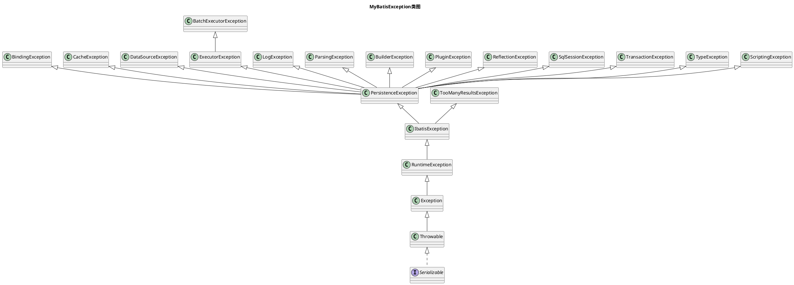

### Exception

```puml
@startuml
Title "MyBatisException类图"
interface Serializable
class Throwable 
class Exception 
class RuntimeException 
class IbatisException 
class PersistenceException 
class TooManyResultsException
class BindingException  
class CacheException 
class DataSourceException 
class ExecutorException 
class BatchExecutorException 
class LogException 
class ParsingException 
class BuilderException 
class PluginException 
class ReflectionException 
class SqlSessionException 
class TransactionException 
class TypeException 
class ScriptingException 
Throwable <|.. Serializable
Exception <|-- Throwable   
RuntimeException <|--  Exception 
IbatisException <|--   RuntimeException 
PersistenceException <|--   IbatisException 
TooManyResultsException <|--   IbatisException 
BindingException  <|--    PersistenceException 
CacheException  <|--    PersistenceException 
DataSourceException  <|--    PersistenceException 
ExecutorException  <|--    PersistenceException 
BatchExecutorException  <|--    ExecutorException  
LogException  <|--    PersistenceException 
ParsingException  <|--    PersistenceException 
BuilderException  <|--    PersistenceException 
PluginException  <|--    PersistenceException 
ReflectionException  <|--    PersistenceException 
SqlSessionException  <|--    PersistenceException 
TransactionException  <|--    PersistenceException 
TypeException  <|--    PersistenceException 
ScriptingException  <|--    PersistenceException 
 
@enduml
```